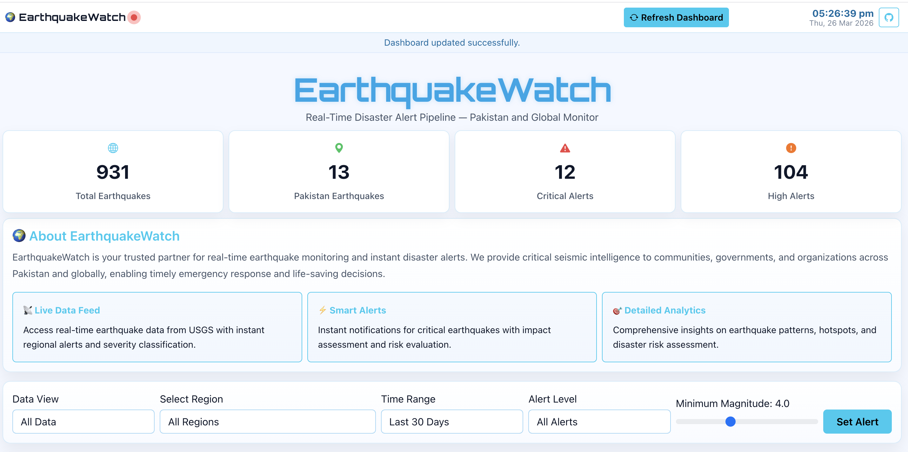
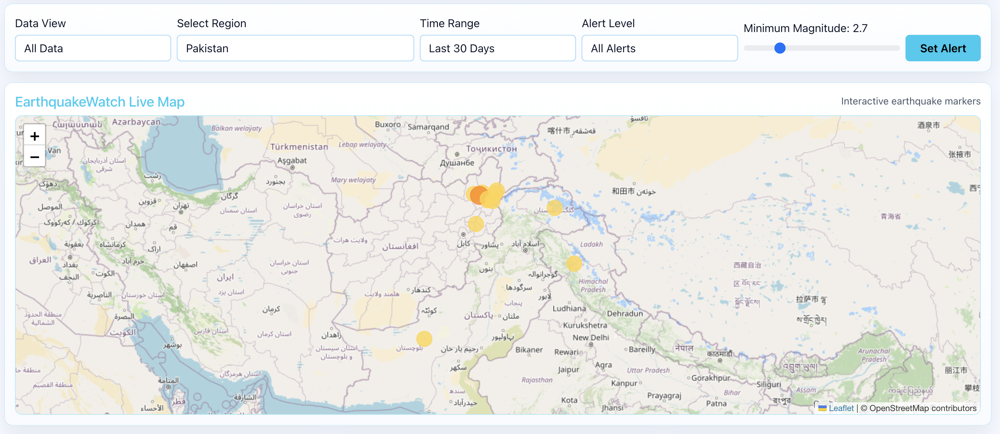
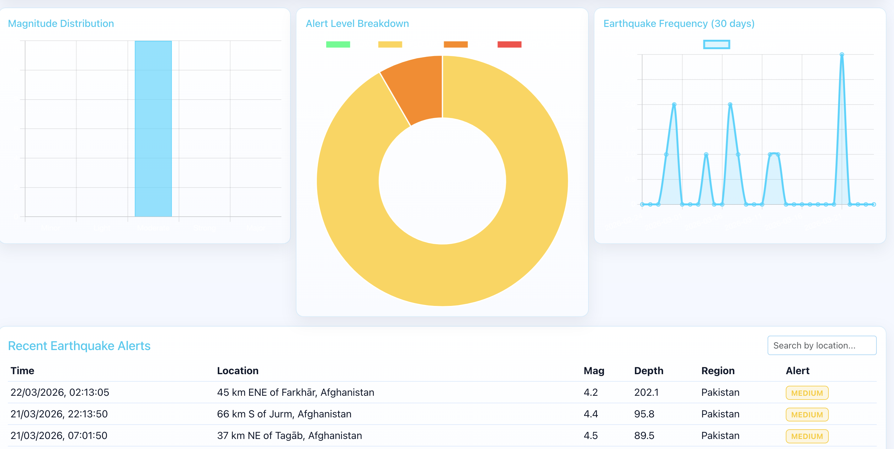
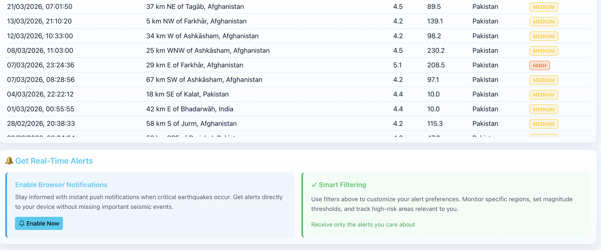
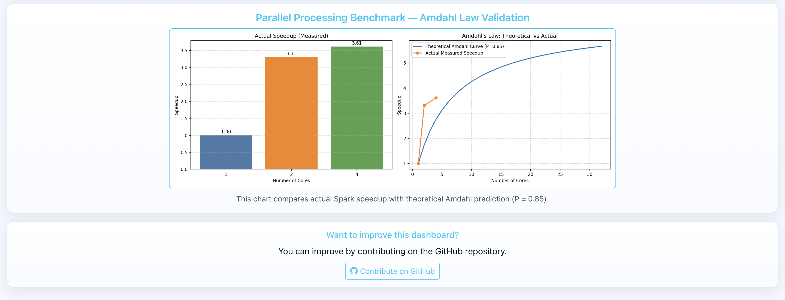

# EarthquakeWatch PDC Project Documentation

## 1. Cover Information
- Project Title: EarthquakeWatch Real-Time Earthquake Monitoring and Alert Pipeline
- Course: Parallel and Distributed Computing (PDC)
- Prepared By: Muhammad Zafar ul Haq
- Submission Date: 17 May 2026
- GitHub Repository: https://github.com/zafar1162014/earthquake-alert-pipeline
- Local Dashboard URL: http://127.0.0.1:5001/

## 2. Executive Summary
EarthquakeWatch is a real-time disaster monitoring system that combines a Flask dashboard with data processing scripts and optional distributed components. The project supports local execution using CSV data and can be extended with Hadoop HDFS and Apache Spark for distributed data storage and analytics.

## 3. Objectives
- Collect and process earthquake data.
- Present interactive dashboard analytics and alerts.
- Demonstrate distributed workflow concepts using Hadoop HDFS and Apache Spark.
- Validate runtime behavior through API and terminal logs.

## 4. System Components
- Web Application: `app.py` (Flask dashboard + API endpoints)
- Data Source: `data/earthquakes.csv`
- Pipeline Scripts: `scripts/01_download_data.py` to `scripts/07_amdahl.py`
- Frontend Template: `templates/index.html`
- Dependencies: `requirements.txt`, `requirements-pipeline.txt`

## 5. Environment Setup and Installation
Use the following generic commands after cloning the repository:

```bash
python3 -m venv .venv
source .venv/bin/activate
pip install -r requirements.txt
pip install -r requirements-pipeline.txt
```

## 6. How to Run the Project

```bash
source .venv/bin/activate
python3 app.py
```

Open in browser:
- http://127.0.0.1:5001/

## 7. Spark and Hadoop HDFS Verification
## 7b. Local HDFS + Spark Run Proof


```bash
python3 -c "import pyspark; print('pyspark', getattr(pyspark,'__version__','not-installed'))"
spark-submit --version
command -v hdfs || echo 'hdfs not found in PATH'
jps | grep -E 'NameNode|DataNode|ResourceManager|NodeManager' || true
```

Observed verification summary for this project run:
- PySpark is available in the Python environment (`pyspark 4.1.1`).
- `spark-submit` is installed and reports Spark `4.1.1`.
- Hadoop HDFS CLI is not installed in the current PATH (`hdfs not found in PATH`).
- No Hadoop daemons were detected in this local run.

Observed terminal proof (exact run evidence) is saved separately for clarity:

- Spark proof text: `docs/screenshots/spark-proof.txt`
- Hadoop proof text: `docs/screenshots/hadoop-hdfs-proof.txt`

## 7c. Verified: HDFS Started & Spark Job Run

The following proof artifacts were produced when running a local pseudo-distributed HDFS and executing the Spark batch job against it. These files are embedded in the submitted DOCX and are available in the repository.

- HDFS binary/version proof: `docs/screenshots/terminal-hadoop-hdfs-proof.png`
- JVM process proof (NameNode/DataNode): `docs/screenshots/terminal-jps-after.png`
- HDFS listing showing uploaded input: `docs/screenshots/terminal-hdfs-ls.png`
- Spark batch job log: `docs/screenshots/terminal-spark-batch-log.png`

The DOCX `EarthquakeWatch_PDC_Documentation.docx` has been regenerated to include these screenshots as final proof of an HDFS + Spark run on the local machine.

## Appendix: Combined Terminal Proof

The image below is a single consolidated terminal screenshot that contains the key verification commands and outputs used for this submission: `pyspark` import, `spark-submit --version`, `hdfs --version` (or note if `hdfs` was not on PATH), `jps` output showing Java daemons, `hdfs dfs -ls` showing the uploaded input, and the tail of the Spark batch job log.


### Spark Verification Proof


### Hadoop HDFS Verification Proof


## 8. Figure 1: End-to-End Workflow Diagram


## 9. Figure 2: Hadoop and Spark Architecture Diagram


## 10. Dashboard Evidence Screenshots

### Figure 3: Dashboard Home (Live)


### Figure 4: API Summary Endpoint


### Figure 5: Analytics and Alerts Views






## 11. Figure 6: Terminal Execution Screenshot

The screenshot below shows successful server startup and successful request handling logs.


## 12. Workflow Explanation
1. Earthquake data is collected and prepared into CSV.
2. Optional HDFS step uploads data into distributed storage.
3. Spark scripts perform batch and streaming-oriented analysis.
4. Flask API serves processed data to the web dashboard.
5. Dashboard visualizes totals, alerts, map points, and benchmarks.

## 13. Conclusion
EarthquakeWatch runs successfully as a local dashboard and is structured for distributed expansion using Hadoop HDFS and Apache Spark. The provided screenshots, diagrams, and terminal evidence confirm system execution flow and deployment readiness for academic demonstration.
