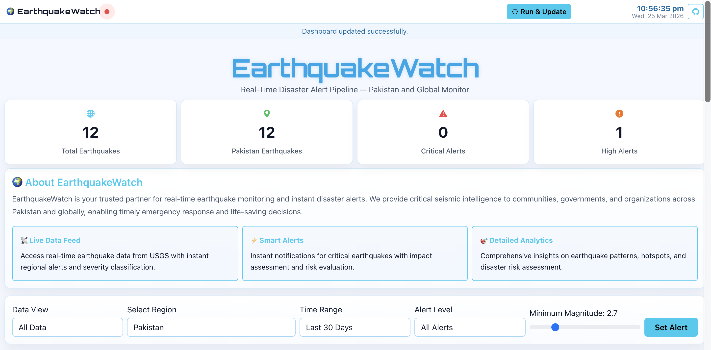

# EarthquakeWatch

EarthquakeWatch is a student project that tracks earthquake activity using a Flask dashboard, pandas data processing, and Spark scripts for batch and streaming tasks. It focuses on global activity with extra attention to Pakistan.

## What this project does

- Downloads earthquake data from the USGS feed
- Labels records as Pakistan or Global based on coordinates
- Shows summary cards, maps, charts, and a data table in a web dashboard
- Runs Spark batch analysis for trends and top locations
- Runs a simple streaming pipeline for live-style alerts
- Benchmarks multi-core speedup using Amdahl's Law

## Project structure

- app.py - Flask backend and API routes
- requirements.txt - Python packages used by this project
- data/earthquakes.csv - Main dataset used by dashboard and scripts
- output/ - Generated files like speedup chart
- scripts/ - Pipeline scripts
  - 01_download_data.py - Downloads and prepares CSV data
  - 02_upload_hdfs.sh - Uploads CSV to Hadoop HDFS
  - 03_batch_analysis.py - Spark batch analysis
  - 04_hotspot.py - Spark hotspot detection by coordinate grid
  - 05_stream_feed.py - Sends CSV rows over socket as a stream
  - 06_stream_alert.py - Reads stream in Spark and classifies alerts
  - 07_amdahl.py - Compares actual and theoretical speedup
- templates/index.html - Dashboard UI

## Technologies used

- Python
- Flask
- pandas
- requests
- PySpark
- matplotlib
- Hadoop HDFS (optional for HDFS paths)
- Leaflet, Chart.js, Three.js (frontend)

## How to run (step by step)

1. Create and activate a virtual environment

- macOS/Linux:
  - python3 -m venv .venv
  - source .venv/bin/activate

2. Install dependencies

- pip install -r requirements.txt

3. Download fresh earthquake data

- python scripts/01_download_data.py

4. Start the dashboard

- python app.py

5. Open in browser

- http://localhost:5001

Note: Port 5001 is used in this project to avoid common macOS conflicts on 5000.

## API endpoints

- GET / - Dashboard page
- GET /api/summary - Totals and magnitude stats
- GET /api/earthquakes - All rows with alert_level
- GET /api/hotspots - Top 20 hotspot cells
- GET /api/pakistan - Pakistan-only rows
- GET /api/recent - Last 100 rows by latest time
- GET /api/speedup - speedup_chart.png
- POST /api/refresh-run - Re-run data refresh script from dashboard

## Dashboard screenshots

Screenshots folder on this repo:

- [docs/screenshots](docs/screenshots)

Save your screenshots in `docs/screenshots/` with these names:

- `dashboard-01-overview.png`
- `dashboard-02-filters-map.png`
- `dashboard-03-charts-table.png`
- `dashboard-04-alerts-table.png`
- `dashboard-05-benchmark.png`

Direct links to each screenshot file:

- [Dashboard Overview](docs/screenshots/dashboard-01-overview.png)
- [Filters and Live Map](docs/screenshots/dashboard-02-filters-map.png)
- [Charts and Recent Alerts](docs/screenshots/dashboard-03-charts-table.png)
- [Alerts Section](docs/screenshots/dashboard-04-alerts-table.png)
- [Amdahl Benchmark](docs/screenshots/dashboard-05-benchmark.png)

Inline preview (works after image files are uploaded to the folder):

## Troubleshooting

If dashboard keeps loading:

- Check backend is running: open /api/summary in browser
- If port is busy, stop old process and start app again
- If CSV is missing, run python scripts/01_download_data.py
- If refresh button fails, check terminal logs for script errors

If Spark scripts fail:

- Make sure Java and Spark are installed
- For HDFS scripts, make sure Hadoop services are running

## GitHub

https://github.com/zafar1162014/earthquake-alert-pipeline
