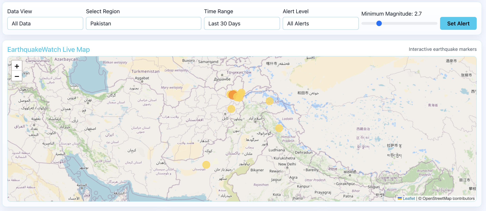
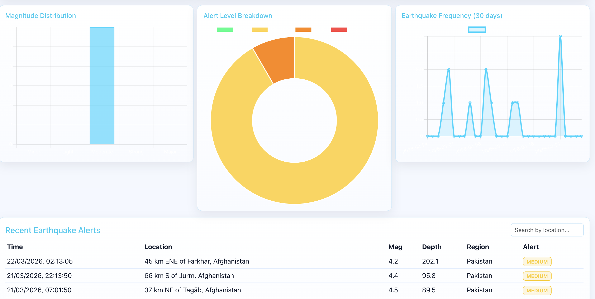
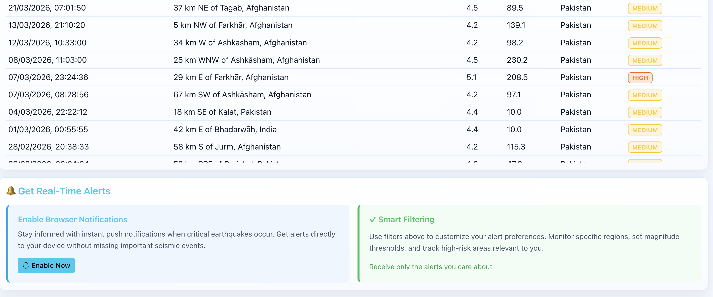
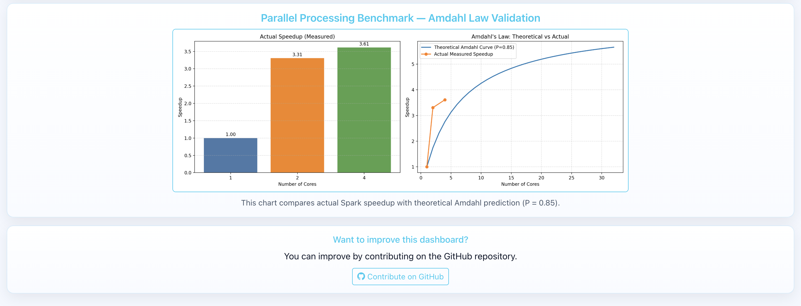

# EarthquakeWatch

EarthquakeWatch is a real-time earthquake monitoring pipeline and dashboard built with Flask, pandas, and PySpark. It combines historical and near-live processing workflows to support data collection, analysis, hotspot detection, and alert generation.

## Overview

This project is designed to:

- Collect earthquake data from the USGS feed.
- Process and classify records for global and Pakistan-focused analysis.
- Present interactive visualizations through a web dashboard.
- Run Spark batch analytics for trends and hotspot summaries.
- Simulate streaming alerts using socket-based feed and Spark streaming logic.
- Compare theoretical versus practical speedup using Amdahl's Law.

## Key Features

- Flask dashboard with summary cards, charts, map layers, and tables.
- REST API endpoints for summary, regional filtering, recent events, and hotspots.
- Modular script pipeline for data download, batch jobs, streaming, and benchmarking.
- Optional Hadoop HDFS integration for distributed storage workflows.

## Tech Stack

- Python
- Flask
- pandas
- requests
- PySpark
- matplotlib
- Hadoop HDFS (optional)
- Leaflet, Chart.js, Three.js

## Repository Structure

- `app.py`: Flask application and API routes.
- `requirements.txt`: Project dependencies.
- `data/earthquakes.csv`: Primary dataset used by dashboard and scripts.
- `output/`: Generated assets such as benchmark charts.
- `scripts/`: Data and analytics pipeline scripts.
- `templates/index.html`: Dashboard front-end template.
- `docs/screenshots/`: Dashboard screenshots.

## Pipeline Scripts

- `scripts/01_download_data.py`: Download and prepare earthquake CSV data.
- `scripts/02_upload_hdfs.sh`: Upload prepared data to HDFS.
- `scripts/03_batch_analysis.py`: Run Spark batch analysis.
- `scripts/04_hotspot.py`: Detect hotspot cells using coordinate grids.
- `scripts/05_stream_feed.py`: Stream CSV rows over socket.
- `scripts/06_stream_alert.py`: Consume stream and classify alerts in Spark.
- `scripts/07_amdahl.py`: Generate Amdahl speedup comparison.

## Getting Started

### Prerequisites

- Python 3.10+
- Java (required for PySpark)
- Apache Spark (required for Spark scripts)
- Hadoop (optional, for HDFS workflow)

### Installation

1. Clone the repository.
2. Create and activate a virtual environment.
3. Install dependencies.

```bash
python3 -m venv .venv
source .venv/bin/activate
pip install -r requirements.txt
```

For full local pipeline support (Spark + benchmark scripts), install:

```bash
pip install -r requirements-pipeline.txt
```

### Run the Project

1. Download fresh data:

```bash
python scripts/01_download_data.py
```

2. Start the dashboard:

```bash
python app.py
```

3. Open the dashboard in your browser at the configured host and port.

## Deploy to Vercel

This repository is ready for Vercel deployment using the included `vercel.json`.

Live App: https://earthquakewatch.vercel.app

### 1. Commit and push

```bash
git add .
git commit -m "Prepare Vercel deployment"
git push origin main
```

### 2. Deploy with Vercel CLI

```bash
npm i -g vercel
vercel login
vercel --prod
```

### Notes

- Vercel runs the Flask app from `app.py` via `@vercel/python`.
- `/api/refresh-run` is disabled on Vercel serverless (returns HTTP 501). Run refresh scripts locally when needed.
- Ensure `data/earthquakes.csv` exists in the repository before deployment.
- `requirements.txt` is intentionally runtime-only for Vercel; use `requirements-pipeline.txt` for full local Spark workflows.

## API Endpoints

- `GET /`: Dashboard page.
- `GET /api/summary`: Aggregated totals and magnitude statistics.
- `GET /api/earthquakes`: Full earthquake dataset with alert levels.
- `GET /api/hotspots`: Top hotspot cells.
- `GET /api/pakistan`: Pakistan-only records.
- `GET /api/recent`: Most recent records.
- `GET /api/speedup`: Generated benchmark chart.
- `POST /api/refresh-run`: Trigger data refresh script.

## Screenshots

Screenshots are available in [docs/screenshots](docs/screenshots).

- [Dashboard Overview](docs/screenshots/dashboard-01-overview-v2.png)
- [Filters and Live Map](docs/screenshots/dashboard-02-filters-map.png)
- [Charts and Recent Alerts](docs/screenshots/dashboard-03-charts-table.png)
- [Alerts Section](docs/screenshots/dashboard-04-alerts-table.png)
- [Amdahl Benchmark](docs/screenshots/dashboard-05-benchmark.png)










## Troubleshooting

- If the dashboard does not load, verify the Flask server is running.
- If data is missing, rerun `scripts/01_download_data.py`.
- If Spark jobs fail, verify Java and Spark installation.
- If HDFS upload fails, confirm Hadoop services are active.

## License

This repository is intended for educational and demonstration use.
